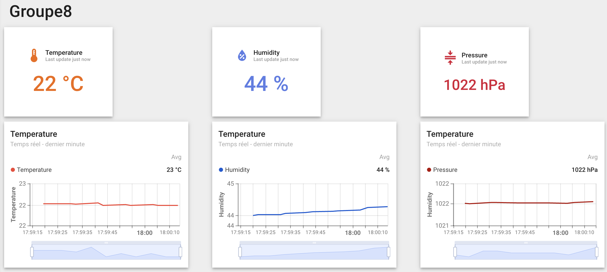
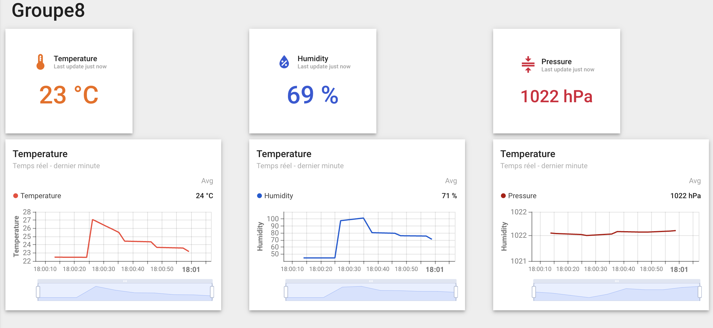

# Prototypage IoT avec 6TRON & mbedOS

- [Installation](#installation)
   - [Prérequis](#prérequis)
   - [Étapes d'installation](#étapes-dinstallation)
- [Commandes utiles](#commandes-utiles)
- [Exercices](#exercices)
   - [Contrôle des GPIO LED1 et BUTTON1 avec ajout d'une interruption](#contrôle-des-gpio-led1-et-button1-avec-ajout-dune-interruption)
   - [Comptage et affichage à l'aide d'un timer](#comptage-et-affichage-à-laide-dun-timer)
   - [Clignotage de la LED via un ticker](#clignotage-de-la-led-via-un-ticker)
   - [Pilotage de la fréquence de clignotement de la LED avec un bouton](#pilotage-de-la-fréquence-de-clignotement-de-la-led-avec-un-bouton)
   - [Lecture des données du capteur Zest_Sensor_P-T-RH](#lecture-des-données-du-capteur-zest_sensor_p-t-rh)
   - [Multitâche avec threads pour l'affichage Ping-Pong et contrôle des LED](#multitâche-avec-threads-pour-laffichage-ping-pong-et-contrôle-des-led)
   - [Utilisation de Mutex pour la synchronisation dans un exemple Ping-Pong](#utilisation-de-mutex-pour-la-synchronisation-dans-un-exemple-ping-pong)
- [Projet](#projet)
- [Sitographies](#sitographies)


## Installation

### Prérequis

1. __Outils__

    - `Git` : logiciel de gestion de versions
    - `Python` : langage de programmation utilisé par les outils Mbed
    - `Pipx` : gestion d'application Python dans des environnement isolés
    - `GNU` Toolchain : chaîne de compilation GNU
    - `Mbed CLI` : utilitaire de configuration et de gestion de la compilation
    - `6TRON Flash` : utilitaire de programmation
    - `J-Link tools` : drivers et outils pour sonde de débogage

2. __Créer un environement virtuel et ajouter le cross-compilateur au PATH__

    - Environement virtuel

        ```bash
        python -m venv <venv_name>
        ```

    - Ajout des path du cross-compilateur à la fin du fichier <venv_name>/bin/activate

        ```bash
        # MBED-OS Path export
        export MBED_GCC_ARM_PATH="/opt/gcc-arm-none-eabi/gcc-arm-none-eabi-10.3-2021-07/bin/"
        export PATH=$MBED_GCC_ARM_PATH:$PATH
        ```
        _**Vérifier que ce chemin existe (il peut être légèrement différent selon les postes de travail)_
        
        _Exemple d'un autre chemin possible_
        ```bash
        export MBED_GCC_ARM_PATH="/opt/gcc-arm-none-eabi/gcc-arm-none-eabi-10.3-2021.07>/bin"
        export PATH=$MBED_GCC_ARM_PATH:$PATH
        ```

### Étapes d'installation

1. __Clonez le dépôt__

    ```bash
    git clone https://github.com/theobriault/EN326_CapteursEmbarque.git
    ```

2. __Activez l'environnement virtuel__

    ```bash
    source <venv_name>/bin/activate
    ```

3. __Déployez les dépendances du projet__

    Déplacez vous dans le dépôt cloné pour déployer les dépendances, soit:

    ```bash
    cd EN326_CapteursEmbarque
    mbed deploy
    ```

4. __Définissez la cible et la chaîne d'outils Mbed__

    ```bash
    mbed target ZEST_CORE_FMLR-72
    mbed toolchain GCC_ARM
    ```

__L'installation est terminé !__


## Commandes utiles

1. Compiler le projet

    ```bash
    mbed compile
    ```

2. Flasher le programme sur la carte

    ```bash
    sixtron_flash
    ```

3. Lancer la communication série avec la carte

    ```bash
    # Remplacer par le bon port ttyUSB

    #option 1
    mbed minicom -D /dev/ttyUSBx -b <BAUDRATE>

    #option 2
    mbed sterm --port /dev/ttyUSBx --baud <BAUDRATE>
    ```


# Exercices

> ⚠️ **Avertissement** : Excepté pour le commit destiné au projet, si les commits des exercices ci-dessous ne contiennent pas le fichier `custom_targets.json` alors suivre les instructions ci-dessous:
- Charger le commit associé à l'exercice (i.e `git checkout <commit>`)
- Créer un fichier `custom_targets.json`
- Ajouter le code suivant dans ce fichier:
    ```json
    {
        "ZEST_CORE_FMLR-72": {
            "inherits": [
                "MCU_STM32L071xZ"
            ],
            "components_add": [
                "SX1272"
            ],
            "overrides": {
                "clock_source": "USE_PLL_HSI"
            },
            "device_name": "STM32L071RZ"
        }
    }
    ```


## Contrôle des GPIO LED1 et BUTTON1 avec ajout d'une interruption

Ce programme montre comment configurer et utiliser les interruptions pour contrôler un GPIO en réagissant aux entrées de l'utilisateur.

### Mise à jour du code source

```bash
# Charger le commit associé
git checkout c69603771651d7085f16c66238629c160085bd17

# Créer le fichier custom_targets.com si inexistant (voir section Exercices avertissement)

# Compiler et flasher
mbed compile
mbed sixtron
```

### Explication du code

1. __Configuration__

    Une LED est configurée comme sortie (à l’aide de `DigitalOut`) et 
    un bouton comme entrée avec interruptions (`InterruptIn`).

2. __Interruption__

    Une fonction d'interruption est appelée lors de l'appui sur le bouton (montée) pour inverser l'état de la LED.

3. __Boucle principale__

    Le programme vérifie si une interruption a été déclenchée pour afficher un message. 
    Une temporisation de 500 ms est ajoutée pour maintenir l'exécution.


## Comptage et affichage à l'aide d'un timer

Ce programme démontre l'utilisation combinée d'un timer et des interruptions pour mesurer et afficher des événements utilisateur.

### Mise à jour du code source

```bash
# Charger le commit associé
git checkout a457968f5516323df9c0a311fa7033686716331e

# Créer le fichier custom_targets.com si inexistant (voir section Exercices avertissement)

# Compiler et flasher
mbed compile
mbed sixtron
```

### Explication du code

1. __Configuration__

    Une LED et un bouton sont configurés avec DigitalOut et InterruptIn. 
    Un timer est initialisé pour mesurer la durée d'appui sur le bouton.

2. __Interruption__

    Lors de l'appui sur le bouton (montée) : la LED change d'état, le timer est réinitialisé et démarré.

    Lors du relâchement (descente) : le timer s'arrête et la durée d'appui est enregistrée.

3. __Boucle principale__

    La boucle principale affiche un message lorsque le bouton est pressé et indique la durée de l'appui lorsque le bouton est relâché. 
    Une temporisation de 500 ms assure le maintien de l'exécution.


## Clignotage de la led via un ticker

Ce programme illustre l'utilisation d'un ticker pour implémenter des actions périodiques combinées à des interruptions pour réagir aux entrées utilisateur.

> ⚠️ **Attention** : Décommenter la ligne ci-dessous (ligne 56) après avoir chargé le commit associé 
```cpp
//flipper.attach(&UpRoutine, frequencies[i]); // the address of the function to be attached (flip) and the interval (2 seconds)
```

### Mise à jour du code source

```bash
# Charger le commit associé
git checkout 2d8e8c7a548d6e77799cab5ee5690b873334d6a1

# Créer le fichier custom_targets.com si inexistant (voir section Exercices avertissement)

# Compiler et flasher
mbed compile
mbed sixtron
```

### Explication du code

1. __Configuration__

    Une LED et un bouton sont configurés avec DigitalOut et InterruptIn. 
    Un ticker est déclaré pour automatiser le clignotement de la LED.

2. __Interruption__

    Lors de l'appui sur le bouton (montée) : la LED change d'état, le timer est réinitialisé et démarré.

    Lors du relâchement (descente) : le timer s'arrête et la durée d'appui est enregistrée.

3. __Ticker__

    Un ticker pourrait être utilisé pour exécuter des actions périodiques comme l'inversion de la LED.

4. __Boucle principale__

    La boucle principale affiche des messages relatifs aux interruptions et au chronométrage, tout en maintenant une temporisation de 500 ms pour assurer l'exécution.

## Pilotage de la fréquence de clignotement de la LED avec un bouton

Ce programme utilise un ticker et un tableau de fréquences pour ajuster dynamiquement le clignotement d'une LED en réagissant aux entrées utilisateur.

### Mise à jour du code source

```bash
# Charger le commit associé
git checkout ea932d4c8a82bade6fa9032f84419bd03f0b56dd

# Créer le fichier custom_targets.com si inexistant (voir section Exercices avertissement)

# Compiler et flasher
mbed compile
mbed sixtron
```

### Explication du code

1. __Configuration__

    Une LED et un bouton sont configurés avec DigitalOut et InterruptIn. Un tableau de fréquences prédéfinies est défini pour ajuster dynamiquement la fréquence de clignotement de la LED.

2. __Interruption__

    Lors de l'appui sur le bouton (montée) : l'index du tableau est incrémenté de manière cyclique pour changer la fréquence.
    Le ticker est reconfiguré pour appliquer la nouvelle fréquence, et un message est affiché dans la console.

3. __Ticker__

    Le ticker appelle une fonction pour inverser l'état de la LED à intervalles réguliers, définis par la fréquence actuelle.

4. __Boucle principale__

    Affiche les changements de fréquence et maintient une temporisation de 500 ms pour l'exécution.

## Lecture des données du capteur Zest_Sensor_P-T-RH

Ce programme utilise le protocole I2C pour communiquer avec le capteur Zest_Sensor_P-T-RH et lire les mesures de température, d'humidité et de pression.

### Mise à jour du code source

```bash
# Charger le commit associé
git checkout ed106fdb810adaefa4cb13b99d1997c0539a8e9d

# Créer le fichier custom_targets.com si inexistant (voir section Exercices avertissement)

# Compiler et flasher
mbed compile
mbed sixtron
```

### Explication du code

1. __Température__

    Une commande (0x00) est envoyée à l'adresse 0x48 (7 bits), et deux octets sont lus pour calculer la température en degrés Celsius, affichée sur la sortie standard.


2. __Humidité__

    Une commande (0xE5) est envoyée à l'adresse 0x40 (7 bits), et deux octets sont lus pour calculer l'humidité relative en pourcentage, affichée sur la sortie standard.


3. __Pression__

    Une tentative de lecture à partir de l'adresse 0x70 (7 bits) est effectuée avec une commande (0xF9). Bien que le code configure la réception de trois octets pour calculer la pression, des ajustements sont nécessaires pour obtenir une mesure valide.

Le programme s'exécute dans une boucle infinie avec une temporisation de 500 ms entre chaque série de lectures. Les données lues sont affichées en temps réel sur la sortie standard.


## Multitâche avec threads pour l'affichage Ping-Pong et contrôle des LED

Ce programme illustre le concept de multitâche avec threads, permettant l'exécution en parallèle de plusieurs fonctions, tout en exploitant les GPIO pour des indicateurs visuels.

### Mise à jour du code source

```bash
# Charger le commit associé
git checkout df20f5679a98971949d105e1121f2289f609778d

# Créer le fichier custom_targets.com si inexistant (voir section Exercices avertissement)

# Compiler et flasher
mbed compile
mbed sixtron
```

### Explication du code

1. __Configuration__

    Deux GPIO sont configurés en sortie pour contrôler les LED1 et LED2. 
    Deux threads sont créés pour exécuter les fonctions ping et pong.

2. __Threads__

    Le thread 1 exécute la fonction ping et affiche "Ping" 100 fois.
    Le thread 2 exécute la fonction pong et affiche "Pong" 100 fois.


3. __Boucle principale__

    La LED1 clignote avec une temporisation de 500 ms pour indiquer que le programme est actif.


## Utilisation de Mutex pour la synchronisation dans un exemple Ping-Pong

Ce programme démontre l'utilisation efficace d'un mutex pour protéger les ressources partagées (stdout) dans un environnement multitâche, évitant ainsi les conflits d'accès tout en garantissant une exécution fluide des threads.

### Mise à jour du code source

```bash
# Charger le commit associé
git checkout 74c9903543a971b78246502178ccc34606dd9960

# Créer le fichier custom_targets.com si inexistant (voir section Exercices avertissement)

# Compiler et flasher
mbed compile
mbed sixtron
```

### Explication du code

1. __Configuration__

   Deux GPIO sont configurés en sortie pour contrôler les LED1 et LED2. Un mutex (Mutex) est déclaré pour synchroniser l'accès à stdout.


2. __Threads__

    Le thread 1 exécute la fonction ping, affiche "Ping" 100 fois, en verrouillant le mutex pour chaque affichage.
    Le thread 2 exécute la fonction pong, affiche "Pong" 100 fois, en utilisant le mutex pour éviter les conflits d'affichage.


3. __Synchronisation__

    Avant chaque affichage dans les threads, le mutex est verrouillé.
    Une fois l'affichage terminé, le mutex est déverrouillé.


4. __Boucle principale__

    La LED1 clignote toutes les 500 ms pour indiquer que le programme est actif.


# Projet

L'objectif de ce projet et de combiner tous les concepts précédents en ajoutant à ceux-ci un protocole LoRaWan pour transmettre les données collectées à un réseau distant.

### Mise à jour du code source

```bash
# Charger le commit associé
git checkout main

# Compiler et flasher
mbed compile
mbed sixtron
```

### Architecture du projet

```bash
App
├── include
│   ├── lora_radio_helper.h    # Configuration et initialisation des modules radio LoRaWAN
│   ├── mbedtls_lora_config.h  # Configuration de la bibliothèque Mbed TLS pour LoRa
│   ├── 2SMPB02E.h   
│   ├── AS621X.h
│   └── HTU21D.h
│      
└── src
    ├── 2SMPB02E.cpp  
    ├── AS621X.cpp
    ├── HTU21D.cpp
    └── main.cpp               # Programme principal du projet

```

- `2SMPB02E` classe permettant de piloter le capteur de pression
- `AS621X` classe permettant de piloter le capteur de température
- `HTU21D`classe permettant de piloter le capteur d'humidité

Nous arrions pu améliorer l'architecture de notre projet en séparant les codes des drivers et de la communication LoRaWan

### Fonctionnalités principales

> ⚠️ **Avertissement** : En raison de contraintes ressources et performances de la carte 6TRON, nous avons développé un code en bare métal plutôt que RTOS

1. __Mesure avec le catpeur Zest PTRH__
    - Acquistion des données environnementales (i.e température, pression, humidité)

2. __Communication LoRaWan__

    - Utilisation de la pile LoRaWan pour l'envoie et la reception des données
    - Les données sont envoyées au serveur distant au format `JSON`
    - Gestion des évènements (i.e connexion, envoie/réception, ...)
    - Envoie des données vers `ThingsBoard`


### Configuration LoRaWan

1. Les paramètres de configuration LoRaWAN, comme les clés d'accès ou le port d'application, sont à définir dans le fichier `mbed_app.json`:
    ```json
    "lora.device-eui": "{ 0xae, 0xff, 0xb8, 0x5b, 0x65, 0xa1, 0x2c, 0xe1 }",
    "lora.application-eui": "{ 0x10, 0xCE, 0x45, 0xFF, 0xFE, 0x00, 0x8C, 0x7E }",
    "lora.application-key": "{ 0x47, 0xf7, 0x08, 0x4b, 0x1f, 0x55, 0x51, 0x4f, 0xb8, 0xa3, 0x37, 0xe8, 0xc9, 0x52, 0x40, 0x19 }"
    ```

    _**Paramètres associés au groupe 8_


2. Taille des buffer `tx`et `rx`
    
    - Il est primordiale de définir une taille de buffer suffisamment grande pour ne pas perdre les données lors de l'envoie ou la réception

### Description du code


_**Les messages sont envoyées de façon périodique avec_ `ev_queue.call_every()`

### Réception des données sur ThingsBoard

- Résultat dans un environnement sans perturbation



- Résultat après avoir soufflé sur la carte



## Sitographies  

[Zest_Sensor_P-T-RH](https://6tron.io/zest/zest_sensor_p_t_rh_1_0_0)

[mbed-os:Full API list](https://os.mbed.com/docs/mbed-os/v6.16/apis/index.html#deprecated-apis)

[ThingsBoard](https://thingsboard.cloud/dashboards/all/5ffe8050-ab07-11ef-a07f-275a0628c822)

[HTU21D:Humidité](https://www.mouser.fr/datasheet/2/418/5/NG_DS_HPC199_6_A1-1128627.pdf)

[AS6212-AWLT-S:Temperature](https://www.mouser.fr/datasheet/2/588/asset_pdf_25493167-3419086.pdf)

[2SMPB-02E:Pression](https://eu.mouser.com/datasheet/2/307/Omron-2SMPB-02E-1275261.pdf)
